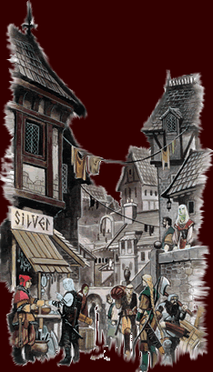

<div align="center">


[한국어](README.md) · [English](README.en.md) · [日本語](README.ja.md) · **简体中文** · [Русский](README.ru.md)

本项目将基于 PHP4 的网页文字 RPG **Legend of the Green Dragon 0.9.7+jt** 韩语版<br>
按与原作完全一致的行为重新实现。


</div>

---

## 游戏流程构成


玩家角色以巨魔、精灵、人类、矮人之一的种族创建，初始位置为村庄广场。角色在武器店与防具店取得装备后
进入森林。

在森林中每遭遇一次生物，森林回合减 1。每次遭遇有 1/7 的概率以特殊事件代替生物出现，胜利时有 1/25 的
概率额外发放宝石 1 颗。胜利将发放金币与经验值，若该场战斗中未受到攻击，则返还上述森林回合 1 或 2。
失败则持有金币全额消失，经验值降至原值的 90%，角色转为死亡状态。

耗尽全部森林回合的角色可在旅店购买麦酒或租用房间。新的一天开始时，体力与森林回合重置。上述森林回合
数值依当日的气力、坐骑、前一日的醉度、怨灵附着与否而增减。角色通过提升等级获得训练所大师的认可，
最终在城堡与绿龙对战。

### 每日更新规则

| 对象       | 处理内容                                                    |
| ---------- | ----------------------------------------------------------- |
| 体力       | 恢复至最大体力并解除死亡状态                                |
| 森林回合   | 在基础回合数上加上当日气力（−2 ~ +2）与龙点数的追加战斗次数 |
| 种族修正   | 种族为人类时，森林回合加 1                                  |
| 坐骑修正   | 持有坐骑时，按该坐骑的追加战斗次数增加森林回合              |
| 宿醉修正   | 醉度超过 66 时，森林回合减 1                                |
| 怨灵修正   | 附着怨灵时，森林回合减 1                                    |
| 银行利息   | 前一日森林回合余量不超过基准值时，为存款加计利息            |
| 特技使用   | 依熟练度计算黑暗魔法、神秘之力、盗贼技巧的每日使用次数      |
| 每日状态值 | 重置玩家对战次数、茅房使用与否、房费支付与否                |

## 区域与画面构成

<table>
<tr>
<td width="33%" align="center"></td>
<td width="33%" align="center"></td>
<td width="33%" align="center"></td>
</tr>
<tr>
<td align="center"><b>村庄广场</b></td>
<td align="center"><b>黑暗森林</b></td>
<td align="center"><b>城堡</b></td>
</tr>
</table>

左侧导航栏由 4 个分组构成，各分组所属画面如下。

| 分组 | 画面                                                                                                   |
| ---- | ------------------------------------------------------------------------------------------------------ |
| 战斗 | 森林、战士训练所、玩家对战、绿龙、墓地、悬赏告示板                                                     |
| 商店 | 武器店、防具店、银行、马厩、宝石商人、治疗师                                                           |
| 村庄 | 村庄广场、旅店、庭园、老兵俱乐部、吉普赛占卜师、茅房                                                   |
| 其他 | 今日消息、公告、邮件、战士名录、名人堂、环境设置、运营申诉、游戏指南、管理菜单、武器编辑器、防具编辑器 |

### 特殊事件构成

代替生物遭遇的特殊事件共 16 种，分为即时发放奖励并结束的类型，与切换至专用画面并要求选择输入的类型。

| 事件                        | 处理内容                                 |
| --------------------------- | ---------------------------------------- |
| 拾得宝石 · 拾得金币         | 即时发放奖励并结束                       |
| 善良老人 · 凶恶老人         | 无需代价发放奖励并结束                   |
| 老人的赌局 · 前往村庄的老人 | 以选择输入接收是否接受赌局或是否移动     |
| 闪光溪流 · 妖精 · 草原      | 在专用画面处理交互                       |
| 谜题                        | 答对时发放奖励，答错时无奖励并结束       |
| 疯狂奥德丽 · 金矿           | 选择承担风险时奖励期望值提高             |
| 技能大师                    | 判定特技熟练度并提升熟练度               |
| 遇难 · 降灵术士             | 接受时同时适用代价与奖励，拒绝时状态不变 |
| 黑马酒馆                    | 切换至专用画面处理酒馆交互               |

## 技术构成

| 区分     | 技术栈                                                                                                                                                                                                                                                                                                                                                                                                      |
| -------- | ----------------------------------------------------------------------------------------------------------------------------------------------------------------------------------------------------------------------------------------------------------------------------------------------------------------------------------------------------------------------------------------------------------- |
| 后端     |                                                                                                   |
| 前端     |     |
| 检查工具 |                                                                                                                                                                                           |

- **后端** — PHP 8.5.9、PSR-4（`Lotdg\` → `api/src/`）、SQLite 3（PDO）、Composer
- **前端** — TypeScript 7、React 19、Vite 8、Zod 4
- **检查工具** — ESLint 10、Prettier 3.9、`tsc -b`、`php -l`
- **多语言** — 韩语 · 英语 · 日语 · 简体中文 · 俄语，并行使用 JSON 标签与数据库标签表
- **画面** — 将旧版 `yarbrough` 模板中实测的颜色与尺寸固定为令牌，直至 8K 仍保持比例
- **许可证** — GPL-2.0-only（[LICENSE](LICENSE)、[NOTICE.md](NOTICE.md)、[AUTHORS.md](AUTHORS.md)）

旧版原件保存于 `reference/`，仅作为比对依据使用。不移植任何代码，全部重新编写。

## 目录结构

```
api/                            PHP 后端
  bin/migrate.php               迁移应用 CLI
  bin/import-legacy-catalog.php 基于旧版转储的目录数据载入 CLI
  config/application.php        路径与环境设置的唯一定义处
  database/
    migration/                  架构定义
    seed/                       属性标签与管理员账号初始数据
    storage/                    SQLite 文件（git 排除）
  public/index.php              HTTP 入口
  src/
    Kernel/                     请求生命周期
    Http/                       路由表、响应、控制器、中间件
    Persistence/                SQLite 连接、迁移、仓储
    Domain/                     领域逻辑（Account, Catalog, Social, World）
    I18n/                       多语言处理
    Support/                    公用工具

src/                            前端
  app/                          根组件、外壳布局、画面代码表
  feature/                      按领域划分的画面（village, forest, battle, commerce, social, ...）
  shared/
    schema/                     Zod 架构（与数据库契约 1:1 对应）
    constant/                   颜色代码、区域设置等的唯一定义处
    type/  lib/  ui/
  i18n/locale/<code>/           各语言标签 JSON
  style/                        设计令牌、旧版颜色、布局

public/asset/legacy/image/      旧版图像资源
reference/                      PHP4 原件（比对用，排除于发布）
```

## 数据库构成

旧版在 `accounts` 单一表中放置了 100 个以上的列，将账号信息与角色信息混杂在一起。本次重新实现在
`api/database/migration/0001_create_schema.sql` 单一文件中，定义了按职责分解的 40 个表。

| 领域   | 表                                                                                                                                                                                                                                  |
| ------ | ----------------------------------------------------------------------------------------------------------------------------------------------------------------------------------------------------------------------------------- |
| 账号   | `account`, `account_privilege`, `account_device_fingerprint`, `account_preference`, `account_donation`, `account_referral`                                                                                                          |
| 角色   | `game_character`, `character_vital`, `character_combat_stat`, `character_progression`, `character_specialty`, `character_equipment`, `character_wealth`, `character_daily_allowance`, `character_social`, `character_session_state` |
| 目录   | `weapon`, `armor`, `creature`, `training_master`, `mount`, `riddle`, `taunt`                                                                                                                                                        |
| 社区   | `daily_news`, `message_of_the_day`, `poll_result`, `commentary`, `mail_message`, `petition`                                                                                                                                         |
| 运营   | `game_setting`, `access_ban`, `nasty_word`, `logdnet_server`, `referer_hit`, `login_failure_log`, `debug_log`                                                                                                                       |
| 多语言 | `locale`, `label_key`, `label_translation`, `catalog_translation`                                                                                                                                                                   |

旧版以 `PHP serialize()` 保存的字段（`prefs`、`bufflist`、`dragonpoints`、`donationconfig`、
`mountbuff` 等）全部转换为 JSON 列。初始数据载入 `database/seed/` 的属性标签与 2 个管理员账号。

## 多语言构成

旧版的 `translator.php` 在 include 各语言 PHP 文件后，**以原文字符串本身作为键**并通过 `str_replace`
进行替换。上述方式只要原文变动一个字符，翻译便不再生效。

本次重新实现以 `(namespace, label_path)` 组合作为键，并由以下两条路径共享同一键体系。

- 静态资源 — `src/i18n/locale/<code>/<namespace>.json`
  （`common`、`navigation`、`authentication`、`character-stat`、`village`、`forest`、`battle`、
  `commerce`、`social`、`system-message` 共 10 种）
- 动态查询 — `label_key` · `label_translation` 表以及 `GET /api/locale/{locale_code}`

不存在翻译的键以回退语言英语（`en`）替代。上述规则与旧版在 `translator_<lang>.php` 缺失时回退至
`translator_en.php` 的行为一致。

## 画面构成

`src/style/lotdg-design-token.css` 将旧版 `yarbrough` 模板中实测的颜色与尺寸保存为令牌。布局不直接
引用原件的像素值，仅引用由 `--lotdg-scale-factor` 派生的令牌，因此倍率变更时仍保持比例。

| 视口         | 倍率 |
| ------------ | ---- |
| ~1279px      | 1    |
| 1280px (HD)  | 1    |
| 1920px (FHD) | 1.5  |
| 2560px (QHD) | 2    |
| 3200px (3K)  | 2.5  |
| 3840px (4K)  | 3    |
| 5120px (5K)  | 4    |
| 6016px (6K)  | 4.5  |
| 7680px (8K)  | 6    |

视口宽度不超过 720px 时，将左侧栏移至正文上方。

旧版输出颜色代码（`` `^ ``、`` `0 `` 等 16 色）由 `src/shared/constant/lotdg-legacy-color-code.ts`
映射为 CSS 类，并由 `src/style/lotdg-legacy-color-class.css` 以令牌实现。类名（`colDkBlue` 等）与
旧版保持一致。

### 图像资源配置

`public/asset/legacy/image/` 中的 GIF 为原件资源，各资源的应用位置如下。

| 资源                                                                                                        | 应用位置                                       |
| ----------------------------------------------------------------------------------------------------------- | ---------------------------------------------- |
|                                           | 外壳页眉的标题横幅（`LotdgShellLayout`）       |
|                                           | 左侧栏面板上端封口                             |
|                                           | 左侧栏面板下端封口                             |
|                                      | 页眉背景（`--lotdg-asset-header-background`）  |
|                                            | 页脚分隔线（`--lotdg-asset-footer-rule`）      |
|                                            | 登录画面的龙环（`--lotdg-asset-login-dragon`） |
|                                           | 村庄场景（`--lotdg-asset-scene-village`）      |
|                                           | 森林场景（`--lotdg-asset-scene-forest`）       |
|                                            | 城堡场景（`--lotdg-asset-scene-castle`）       |
| `marker-new.gif` · `scroll-new.gif` · `scroll-old.gif` · `signature-mightye.gif` · `spacer-transparent.gif` | 原件保存资源，当前画面不予引用                 |

## 开发

### 准备

```bash
npm install
cd api && composer install && cd ..
npm run migrate                          # api/bin/migrate.php — 应用 SQLite 架构
php api/bin/import-legacy-catalog.php    # 从旧版转储载入武器、防具、生物等
```

目录数据载入 CLI 在未指定参数时读取 `reference/logd-0.9.7-create.sql`，并输出各表载入的条数。使用
其他转储时，以该文件路径作为参数指定。

### 运行

`npm run dev` 同时启动前端与 PHP 后端。Vite 开发服务器将 `/api` 请求代理至 `127.0.0.1:8080` 的 PHP
内置服务器。

```bash
npm run dev           # web + api 同时运行（concurrently）
npm run dev:web       # 仅 vite
npm run dev:api       # php -S 127.0.0.1:8080 -t api/public api/public/router.php
```

`api/public/router.php` 为内置服务器专用回退。实际部署环境中由 Web 服务器的重写规则替代上述作用，
因此仅将 `api/public/index.php` 指定为入口。

### 构建

```bash
npm run build         # build:web + build:api
npm run build:web     # tsc -b && vite build     → dist/
npm run build:api     # node scripts/build-api.mjs → dist/api/
```

`build:api` 仅将 `src` · `public` · `config` · `bin` · `database/migration` · `database/seed` ·
`composer.json` 复制至 `dist/api/`，随后在该路径执行 `composer install --no-dev
--optimize-autoloader`。`reference/` 与 SQLite 文件排除于产物之外。

### 检查

```bash
npm run check         # typecheck + lint + format:check
npm run typecheck     # tsc -b
npm run lint          # eslint
npm run lint:php      # 在 api 内执行 composer run lint（php -l 全量）
npm run format:check  # prettier
```

验证仅通过静态分析、类型检查与代码审查进行。不将启动开发服务器或执行构建以查看错误作为验证手段。

## 许可证

采用 GPL-2.0-only。原作者 Eric Stevens 与 JT（Joe Naylor）、旧版韩语本地化负责人 xc8oa 与 digirave、
本次重新实现的移植者 GarnetRapture 的贡献，均在 [AUTHORS.md](AUTHORS.md) 中载明。具有法律效力的文件
为 [LICENSE](LICENSE) 的英文原文，[NOTICE.md](NOTICE.md) 为 5 种语言的说明性告知。

<div align="center">


Copyright 2002-2006 Eric Stevens &amp; JT · Ported by GarnetRapture · GPL-2.0-only

</div>
